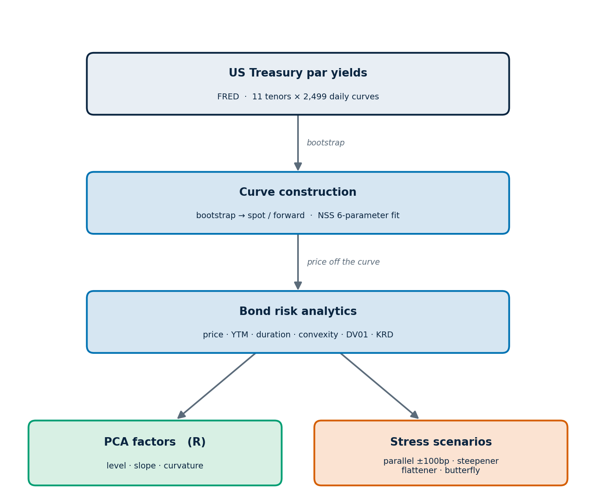
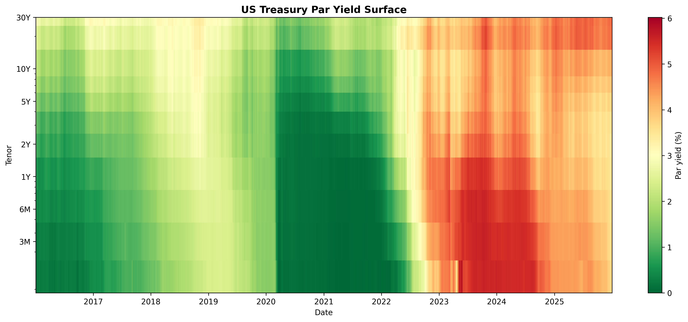
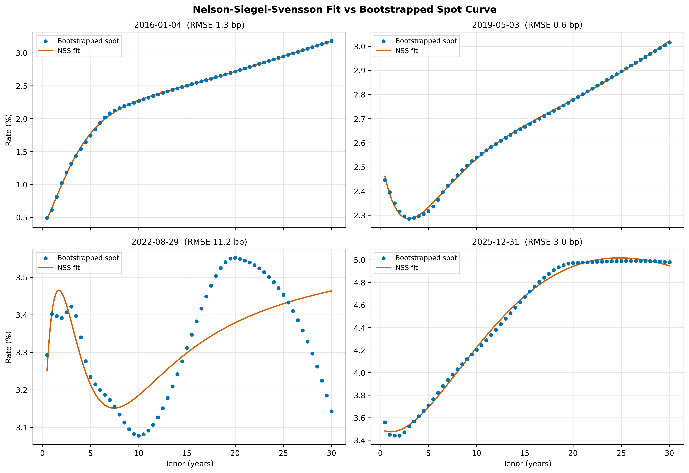
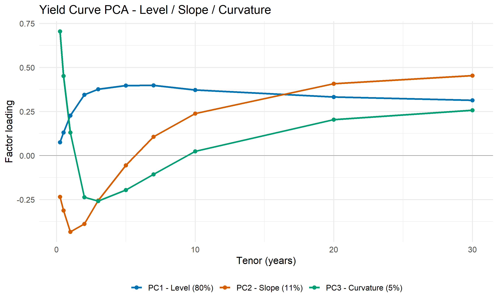
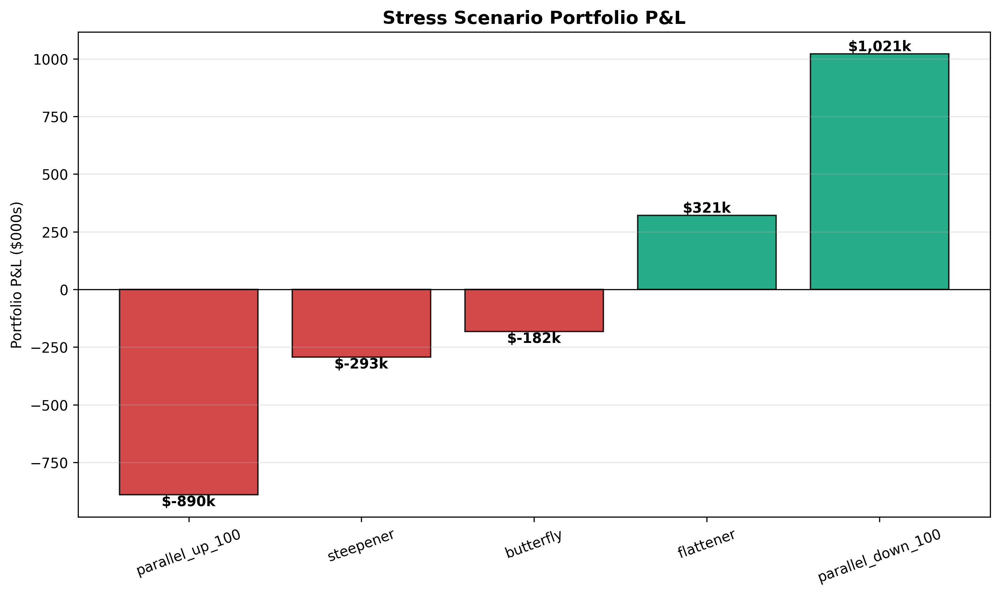

# Rates Risk Engine

*US Treasury yield-curve construction & fixed-income risk analytics.*

This project implements the pipeline a rates desk uses to measure interest-rate risk. Starting from raw US Treasury par yields, it builds the zero-coupon curve (bootstrap + Nelson-Siegel-Svensson), prices a bond portfolio off that curve, and quantifies the risk three complementary ways — duration / DV01 / key-rate durations, a PCA decomposition of historical curve moves into level/slope/curvature factors, and parallel & non-parallel stress scenarios. Python drives the analytics, R runs the PCA, and every stage persists to SQLite.



---

## Portfolio & key results

A **synthetic** 10-bond USD portfolio — 8 Treasuries spanning 2Y–30Y (including a 10Y zero-coupon STRIP used as a duration benchmark) plus 2 higher-coupon names — priced off the bootstrapped spot curve on **2025-12-31**. Every bond is discounted on the Treasury curve (no credit spread is modelled), so the book is a vehicle for demonstrating curve and rate-risk analytics, not a real portfolio.

| Metric | Value |
| --- | --- |
| Curve history | 2,499 daily curves (2016-01-04 → 2025-12-31) |
| NSS calibration error | 1.74 bp median |
| Portfolio market value | $11.78M ($12M face) |
| Portfolio DV01 | $9,631 per bp |
| PCA factors | 80% / 11% / 5% — level / slope / curvature (96% cumulative) |
| Worst stress scenario | −$890K (parallel +100 bp) |

| Bond | Coupon | Maturity | Face | Price | YTM | Mod Dur | DV01 |
| --- | --- | --- | --- | --- | --- | --- | --- |
| UST_2Y | 4.25% | 2y | $1.0M | 1,014,944 | 3.44% | 1.94 | 197 |
| UST_3Y | 4.00% | 3y | $1.0M | 1,012,709 | 3.52% | 2.86 | 289 |
| UST_5Y | 4.00% | 5y | $1.0M | 1,012,252 | 3.69% | 4.58 | 464 |
| UST_7Y | 4.10% | 7y | $1.0M | 1,009,776 | 3.90% | 6.16 | 622 |
| UST_10Y | 4.25% | 10y | $2.0M | 2,011,490 | 4.14% | 8.26 | 1,661 |
| UST_10Y_STRIP | 0.00% | 10y | $1.0M | 656,946 | 4.20% | 10.00 | 657 |
| UST_20Y | 4.50% | 20y | $1.0M | 961,853 | 4.74% | 13.25 | 1,274 |
| UST_30Y | 4.50% | 30y | $2.0M | 1,891,041 | 4.79% | 16.36 | 3,094 |
| CORP_5Y | 5.50% | 5y | $1.0M | 1,080,318 | 3.69% | 4.46 | 482 |
| CORP_10Y | 5.75% | 10y | $1.0M | 1,128,850 | 4.12% | 7.90 | 891 |
| **Portfolio** | | | **$12.0M** | **11,780,179** | | | **9,631** |

---

## Methodology

### Curve construction

| Step | Idea |
| --- | --- |
| **Bootstrap** | Interpolate par yields onto a semiannual grid with a monotone spline, then recover discount factors by forward substitution on the par-bond identity `1 = (c/2)·ΣD(tᵢ) + D(tₙ)`. Spot rate `zₙ = −ln D(tₙ)/tₙ`. |
| **NSS** | Fit the six-parameter Nelson-Siegel-Svensson form `y(t) = β₀ + β₁·f₁ + β₂·f₂ + β₃·f₃` by nonlinear least squares (`scipy.optimize.least_squares`). |

### Risk analytics

| Measure | Idea |
| --- | --- |
| **Duration / convexity** | First and second moments of the present-value-weighted cash flow times; the local sensitivity of price to yield. |
| **DV01** | Price change for a 1 bp parallel shift, by full revaluation. |
| **Key rate duration** | Price change under localised tent-shaped shifts at the 2Y / 5Y / 10Y / 20Y / 30Y nodes. The tents sum to a parallel shift, so the KRDs reconcile to DV01. |

### Factor analysis and stress

| Step | Idea |
| --- | --- |
| **PCA** | Eigen-decompose the covariance of daily curve changes. The first three components are level, slope, and curvature. |
| **Stress** | Fully reprice the portfolio under parallel (±100 bp), steepener, flattener, and butterfly shocks. Full revaluation captures convexity. |

---

## Tech stack


- **Python** — bootstrap, NSS calibration, bond analytics, DV01 / KRD, stress, figures, PDF report
- **R** (`prcomp`, `ggplot2`) — PCA decomposition of curve changes and the loadings figure
- **SQL** (SQLite) — eight-table schema for yields, curves, parameters, analytics, factors, and stress results

---

## Project structure

```
YieldCurve/
├── src/
│   ├── config.py             # tenors, FRED series, bond portfolio, parameters
│   ├── data_pipeline.py      # FRED download → SQLite
│   ├── bootstrap.py          # par → spot → forward
│   ├── nss.py                # Nelson-Siegel-Svensson calibration
│   ├── bond_analytics.py     # pricing, duration, convexity
│   ├── key_rate_duration.py  # DV01 + key rate durations
│   ├── stress.py             # stress scenarios
│   └── visualize.py          # figures 1, 2, 4
├── r/
│   └── pca_yield_curve.R     # PCA + figure 3
├── sql/schema.sql
├── tests/test_analytics.py
├── notebooks/01_demo.ipynb
├── figures/   report/   data/
└── requirements.txt
```

---

## Selected figures

### Figure 1. Treasury par yield surface



*US Treasury par yield surface, 2016–2025 (2,499 daily curves from FRED). The deep-green band through 2020–2021 is the zero-rate era; the red short end in 2023–2024 is the curve inversion, where 3M–2Y yields rose above 10Y–30Y.*

### Figure 2. NSS calibration



*NSS fitted curves (orange) against bootstrapped spot rates (blue) on four representative dates. The fit is tight on normal curves (0.6–3 bp) and degrades on the deeply inverted, double-humped August-2022 curve (11 bp), illustrating the limits of the parametric form on extreme shapes.*

### Figure 3. PCA of curve changes



*Loadings of the first three principal components of daily curve changes. PC1 is flat (a level shift, 80% of variance), PC2 is monotone in tenor (slope, 11%), and PC3 is convex (curvature, 5%) — the canonical Litterman-Scheinkman decomposition.*

### Figure 4. Stress P&L



*Portfolio P&L under each scenario. The +100 bp parallel shift loses $890K while −100 bp gains $1,021K; the asymmetry is convexity. Steepener and flattener are near mirror images, as expected for a long-only book.*

---

## How to run

```bash
# 1. Install dependencies
pip install -r requirements.txt

# 2. Download par yields and build SQLite (one-time)
python -m src.data_pipeline

# 3. Bootstrap spot / forward curves
python -m src.bootstrap

# 4. Calibrate Nelson-Siegel-Svensson
python -m src.nss

# 5. Price bonds and compute duration / convexity
python -m src.bond_analytics

# 6. DV01 and key rate durations
python -m src.key_rate_duration

# 7. PCA decomposition (requires R; install R packages once)
Rscript r/install_packages.R
Rscript r/pca_yield_curve.R

# 8. Stress scenarios
python -m src.stress

# 9. Figures 
python -m src.visualize

```

---

## References

- Nelson, C. R., & Siegel, A. F. (1987). Parsimonious Modeling of Yield Curves. *Journal of Business*, 60(4), 473–489.
- Svensson, L. E. O. (1994). Estimating and Interpreting Forward Interest Rates: Sweden 1992–1994. *NBER Working Paper 4871*.
- Litterman, R., & Scheinkman, J. (1991). Common Factors Affecting Bond Returns. *Journal of Fixed Income*, 1(1), 54–61.
- Tuckman, B., & Serrat, A. (2011). *Fixed Income Securities: Tools for Today's Markets*, 3rd ed. Wiley.
- Hull, J. C. (2018). *Options, Futures, and Other Derivatives*, 10th ed. Pearson.
